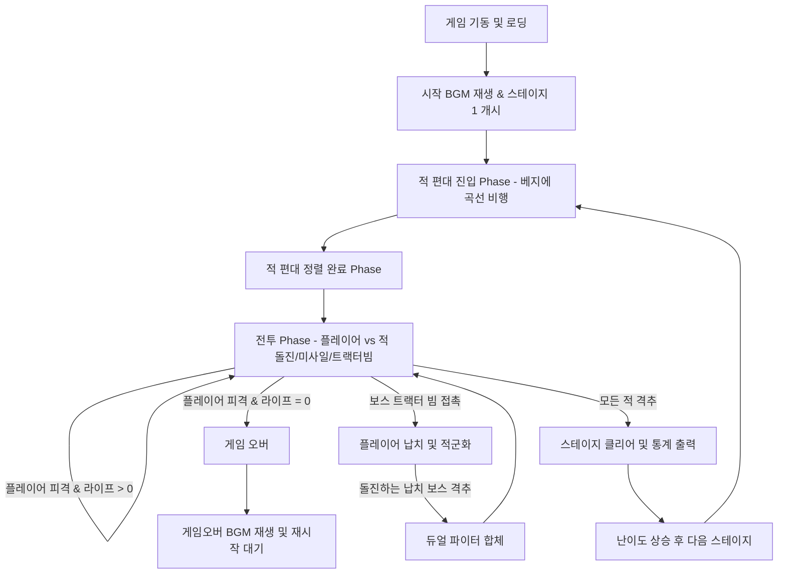

# 갤러그(Galaga) HTML5 아케이드 게임 요구사항 정의서 (SRS)

## 1. 개요 (Introduction)
### 1.1 게임 개요
본 문서는 고전 명작 아케이드 게임 '갤러그(Galaga)'의 핵심 메커니즘을 현대적인 HTML5 환경(Canvas 2D API 및 Vanilla JS)에 적합하게 재해석하고 구현하기 위한 요구사항 정의서(SRS)이다.
### 1.2 개발 원칙 및 대상 플랫폼
- **플랫폼**: PC 및 모바일 웹 브라우저 (반응형 대응)
- **기술 스택**: HTML5 Canvas, Vanilla JavaScript (외부 이미지/사운드 에셋 로드 없이 단일 파일로 구동될 수 있도록 설계)
- **그래픽/사운드**: 내장 픽셀 맵 데이터를 활용한 8비트 도트 그래픽 및 Web Audio API 기반 오디오 실시간 합성

---

## 2. 핵심 플레이 루프 (Core Play Loop)



### 2.1 단계별 루프 상세
1. **시작(Start)**: 메인 화면에서 대기 후 게임 시작 버튼 또는 키 입력 시 레트로 BGM이 연주되며 스테이지 1이 시작된다.
2. **진입(Entry)**: 적들이 화면 밖에서 2~3차 베지에 곡선을 그리며 날아와 격자 포메이션(가로 10열, 세로 4~5행)으로 정렬한다.
3. **전투(Combat)**:
   - 정렬된 적들은 무작위로 하강(돌진) 공격을 시도하며 미사일을 발사한다.
   - 보스 갤러그는 하강 도중 트랙터 빔을 발사하여 플레이어를 납치할 수 있다.
   - 납치된 플레이어 파이터는 보스의 호위를 받으며 적 포메이션에 배치된다.
   - 납치된 파이터를 대동한 보스가 하강할 때 보스만 정밀 타격하여 파괴하면 포획된 파이터가 구조되어 플레이어 기기와 좌우로 합체(듀얼 파이터)한다.
4. **스테이지 클리어(Stage Clear)**: 화면 내의 모든 에일리언(포획된 아군 포함)을 섬멸하면 스테이지가 종료되며 명중률 보너스 정산 후 다음 스테이지로 진입한다.
5. **게임 오버(Game Over)**: 잔기(Life)가 모두 소진되면 게임 오버 멜로디가 연주되고 최종 점수와 단계가 화면에 고정된다.

---

## 3. 오브젝트 규격 및 물리 수치 사양
### 3.1 화면 및 좌표계
- **표준 해상도**: 가로 448 픽셀 × 세로 512 픽셀 (오리지널 종횡비 계승)
- **모바일 뷰포트**: 디바이스 크기에 맞춰 해상도를 유지한 채 CSS `object-fit: contain` 방식으로 캔버스를 화면 중앙에 피팅.
- **좌표계**: 좌상단이 (0, 0), 우하단이 (448, 512)

### 3.2 오브젝트 상세 명세

| 오브젝트명 | 기본 크기 (W x H px) | 초기 위치 (X, Y) | 이동 속도 | 피격 판정 범위 (Box) | 체력 (HP) | 주요 특징 및 제한 사항 |
| :--- | :--- | :--- | :--- | :--- | :--- | :--- |
| **싱글 파이터** | 16 x 16 | (224, 450) | 좌우 4 px/frame | Box (14 x 14) | 1 | 플레이어가 조종하는 기본 전투기 |
| **듀얼 파이터** | 32 x 16 | 합체 시점의 좌표 | 좌우 4 px/frame | Box (30 x 14) | 각 1 (총 2) | 가로 크기 2배 확장. 투사체 2발 동시 발사. 피격 시 1대만 폭발 후 싱글로 복귀 |
| **플레이어 미사일**| 2 x 8 | 발사 시 파이터 상단 | 상향 8 px/frame | Box (2 x 8) | - | 화면 내 최대 2발(싱글) / 4발(듀얼) 제한 |
| **보스 갤러그** | 16 x 16 | 포메이션 최상단 2행 | 진입 3, 하강 2 px/frame | Box (16 x 16) | 2 | 1차 피격 시 색상 변경(파랑->초록). 돌진 시 트랙터 빔 사용 |
| **가드 에일리언** | 16 x 16 | 포메이션 중단 2행 | 진입 3, 하강 2.5 px/frame| Box (14 x 14) | 1 | 돌진 시 좌우 날개짓 애니메이션, 지그재그 하강 |
| **드론 에일리언** | 16 x 16 | 포메이션 하단 1행 | 진입 3, 하강 3 px/frame | Box (14 x 14) | 1 | 속도가 가장 빠르며 회전 돌진 빈도가 높음 |
| **적 미사일** | 3 x 6 | 적 발사 시점 좌표 | 하향 3.5 px/frame | Box (3 x 6) | - | 레벨에 따라 플레이어 방향으로 약간의 각도 유도 적용 |
| **트랙터 빔** | 상32~하96 x 150| 보스 하강 정지 좌표 하단| - | Polygon (역사다리꼴) | - | 보스 하강 후 Y=300 지점에서 6초간 방출. 접촉 시 플레이어 포획 |

---

## 4. 핵심 메커니즘 상세 기획

### 4.1 베지에 곡선 편대 진입 (Bézier Curve Entrance)
- 각 스테이지 시작 시 적들은 8마리씩 총 5개 그룹으로 나뉘어 순차적으로 등장한다.
- 3차 베지에 곡선 공식을 적용하여 이동 경로를 계산한다.
  - 공식: $B(t) = (1-t)^3 P_0 + 3(1-t)^2 t P_1 + 3(1-t)t^2 P_2 + t^3 P_3 \quad (t \in [0, 1])$
  - 1그룹당 진입 소요 시간: 160프레임 (약 2.6초, 프레임당 $t$ 증가량 = 1/160 = 0.00625)
- **대표 진입 곡선 좌표 리스트**:
  1. **좌측 상단 진입 후 루프 곡선**:
     - $P_0 = (-20, 100)$ (화면 좌측 바깥)
     - $P_1 = (150, 50)$
     - $P_2 = (250, 300)$
     - $P_3 = (T_x, T_y)$ (지정된 포메이션 목표 좌표)
  2. **우측 상단 진입 후 루프 곡선**:
     - $P_0 = (468, 100)$ (화면 우측 바깥)
     - $P_1 = (298, 50)$
     - $P_2 = (198, 300)$
     - $P_3 = (T_x, T_y)$
  3. **중앙 하단 진입 후 회전 곡선**:
     - $P_0 = (224, 530)$ (화면 하단 바깥)
     - $P_1 = (100, 200)$
     - $P_2 = (348, 100)$
     - $P_3 = (T_x, T_y)$

### 4.2 보스 트랙터 빔 & 납치 (Tractor Beam & Capture)
1. **발동**: 포메이션 상태에 있던 보스 중 한 마리가 돌진 패턴에 돌입한다.
2. **하강 및 정지**: Y=300 좌표에 도달하면 보스는 돌진을 멈추고 좌우로 흔들리며 아래쪽으로 트랙터 빔을 방출한다.
3. **빔 사양**:
   - 상단 가로: 32 px, 하단 가로: 96 px, 높이: 150 px의 역사다리꼴 영역.
   - 투명도(Alpha)가 0.3~0.5 사이로 진동하는 청색/자색 격자 무늬 그래픽 효과.
   - 방출 지속 시간: 360 프레임 (6초).
4. **포획 판정**:
   - 싱글 플레이어 파이터의 충돌 박스가 트랙터 빔 영역 내로 진입하면 즉시 조작 제어권을 상실한다.
   - 플레이어 기기는 회전하면서 보스 에일리언의 중앙 하단부(Y=300)로 서서히 끌려 올라간다 (프레임당 Y축 -2px 이동).
   - 흡수가 완료되면 화면에 경고음이 울리고, 플레이어 잔기(Life)가 1 감소한 후 화면 아래에서 새로운 플레이어 파이터가 스폰된다.
   - 납치된 파이터는 붉은색 색상 필터가 씌워진 채로 보스 에일리언의 머리 위에 도킹되어 보스를 따라 적 포메이션 위치로 돌아간다.
   - **예외**: 플레이어 기기가 마지막 라이프인 상태에서 빔에 포획되면 구출 기회 없이 즉시 Game Over가 된다.

### 4.3 듀얼 파이터 합체 (Dual Fighter Fusion)
1. **구출 조건**:
   - 납치된 파이터를 대동하고 돌진 공격을 해오는 보스 에일리언을 격추해야 한다.
   - **절대 조건**: 보스 에일리언만 정확하게 파괴해야 하며, 납치된 파이터를 맞출 경우 해당 파이터는 아군 오인 사격으로 간주되어 1,000점 획득 후 영구 소멸한다.
2. **합체 프로세스**:
   - 보스 에일리언이 격추되면 납치되었던 파이터는 자유 상태가 되어 부드러운 나선형 궤적을 그리며 화면 하단의 현재 플레이어 파이터 좌측 또는 우측에 밀착한다.
   - 도킹 애니메이션(1.5초간 무적 및 좌우 결합 연출)이 끝나면 듀얼 파이터가 완성된다.
3. **듀얼 파이터 상태의 능력치 변경**:
   - **공격**: 스페이스바 클릭 시 좌측과 우측 파이터 총구에서 각각 1발씩, 총 2발의 레이저가 동시 발사된다 (가로 간격 16px).
   - **피격**: 듀얼 파이터 상태에서 적의 공격(미사일 또는 충돌)에 맞았을 때, 맞은 쪽의 파이터만 폭발 이펙트와 함께 파괴되며, 남은 쪽의 파이터는 즉시 싱글 파이터 상태로 유지된다. (이때 라이프 감소 페널티 없음).

---

## 5. 조작 인터페이스 (Control Interface)

### 5.1 PC 키보드
- **좌측 이동**: `Left Arrow` (Key Code 37) 또는 `A` (Key Code 65)
- **우측 이동**: `Right Arrow` (Key Code 39) 또는 `D` (Key Code 68)
- **레이저 발사**: `Spacebar` (Key Code 32)
- **기타**: 게임 시작 `Enter` (Key Code 13), 일시정지 `P` (Key Code 80)

### 5.2 모바일 가상 조작 터치 패드
모바일 디바이스(터치 스크린 지원 환경) 감지 시 Canvas 하단에 가상 터치 영역을 레이아웃한다.

- **디자인 규격**:
  - **좌/우 방향키**: 화면 하단 좌측 영역에 가상 D-패드 배치.
    - 좌측 버튼: 중심 (X=50, Y=580), 반경 30px, 좌측 화살표 아이콘.
    - 우측 버튼: 중심 (X=130, Y=580), 반경 30px, 우측 화살표 아이콘.
  - **발사(Fire) 버튼**: 화면 하단 우측 영역에 원형 버튼 배치.
    - 중심 (X=380, Y=580), 반경 40px, 붉은색 투명 레이아웃 (`rgba(255, 0, 0, 0.6)`), "FIRE" 텍스트 각인.
- **터치 이벤트 핸들링**:
  - `touchstart`, `touchend`, `touchmove` 이벤트를 캡처하여 각 버튼 영역 내부 좌표 터치 여부를 판별한다.
  - 입력 지연(Input Lag) 방지를 위해 `e.preventDefault()`를 호출하여 스크롤 및 탭 줌 동작을 차단한다.
  - 발사 버튼의 경우, 터치 시 최초 1회 발사되고 손가락을 떼었다가 다시 터치해야 발사되는 단발 사격 모드 및 200ms 단위 자동 연사 모드를 병행 지원한다.

---

## 6. 사운드 기획 (Web Audio API)
모든 오디오는 외부 `.mp3` 또는 `.wav` 파일 없이 Web Audio API를 사용하여 실시간 신디사이징으로 구현한다.

### 6.1 효과음 (SFX) 사양

| 효과음 이름 | 발동 시점 | AudioNode 구성 및 오실레이터 타입 | 주파수 변동 범위 (Hz) | 지속 시간 (sec) | 볼륨 (Gain) 제어 |
| :--- | :--- | :--- | :--- | :--- | :--- |
| **레이저 발사음** | 플레이어 미사일 발사 | OscillatorNode (`sawtooth`) | 880Hz $\rightarrow$ 110Hz (급격한 지수 감쇄) | 0.12s | 0.2 $\rightarrow$ 0.0 (Linear Decay) |
| **적 격추음 (소형)** | 가드/드론 에일리언 파괴| AudioBuffer (White Noise) + BPF | Noise + 400Hz 밴드패스 필터 | 0.25s | 0.5 $\rightarrow$ 0.0 (Exponential Decay) |
| **보스 격추음** | 보스 갤러그 파괴 | AudioBuffer (White Noise) + LowPass | Noise + 200Hz LowPass 필터 | 0.40s | 0.8 $\rightarrow$ 0.0 (Exponential Decay) |
| **트랙터 빔** | 트랙터 빔 활성화 중 | LFO (Modulator 6Hz) $\rightarrow$ FM 합성 | Modulator: 6Hz, Carrier: 220Hz | 6.00s (루프) | 0.3 (일정 볼륨 유지) |
| **플레이어 폭발** | 플레이어 피격 사망 | Oscillator (`square` + `sawtooth`) + Noise| 150Hz $\rightarrow$ 40Hz + Noise | 0.60s | 0.6 $\rightarrow$ 0.0 |

### 6.2 레트로 멜로디 BGM 시퀀스 (8-bit Melody BGM)
메인 테마 및 게임오버 음악은 Web Audio API의 `OscillatorNode('square')`와 `GainNode`를 사용하여 음표 배열 데이터를 순차 연주한다.

- **음표 주파수 매핑 테이블**:
  - C4: 261.63Hz, D4: 293.66Hz, E4: 329.63Hz, F4: 349.23Hz, G4: 392.00Hz, A4: 440.00Hz, B4: 493.88Hz
  - C5: 523.25Hz, D5: 587.33Hz, E5: 659.25Hz, F5: 698.46Hz, G5: 783.99Hz, A5: 880.00Hz, B5: 987.77Hz
- **스테이지 시작 멜로디 (Melody Note Sequence)**:
  - 템포: BPM = 120 (4분음표 = 0.5초, 8분음표 = 0.25초, 16분음표 = 0.125초)
  - 멜로디 시퀀스:
    1. G4 (8분음표) -> C5 (8분음표) -> G4 (8분음표) -> E4 (8분음표)
    2. G4 (16분음표) -> G4 (16분음표) -> C5 (8분음표)
    3. D5 (8분음표) -> E5 (8분음표) -> F5 (8분음표) -> G5 (4분음표)
- **게임 오버 멜로디**:
  - 멜로디 시퀀스 (하행 스케일로 우울한 톤 연출):
    1. B4 (8분음표) -> A4 (8분음표) -> G4 (8분음표) -> F4 (8분음표)
    2. E4 (4분음표) -> D4 (4분음표) -> C4 (2분음표)

---

## 7. 비주얼 및 스프라이트 픽셀 맵 데이터
외부 리소스 없이 Canvas 2D API의 `fillRect` 또는 `ImageData`를 이용하여 도트 아트를 렌더링하기 위해 16x16 픽셀 스프라이트 데이터를 코드 상에 2차원 배열로 기재한다.

### 7.1 컬러 팔레트 정의
- `.`: 투명 (Transparent)
- `W`: 흰색 (`#FFFFFF`)
- `R`: 빨간색 (`#FF0000`)
- `B`: 파란색 (`#0000FF`)
- `G`: 초록색 (`#00FF00`)
- `Y`: 노란색 (`#FFFF00`)
- `C`: 하늘색 (`#00FFFF`)

### 7.2 오브젝트별 픽셀 맵 스프라이트 예시 (16x16 Grid)

#### 플레이어 파이터 (Player Fighter)
```
. . . . . . . W W . . . . . . .
. . . . . . W W W W . . . . . .
. . . . . W W W W W W . . . . .
. . . . . W R W W R W . . . . .
. . . . . W R W W R W . . . . .
. . . . W W W W W W W W . . . .
. . . W W W W W W W W W W . . .
. . W W W W R R R R W W W W . .
. W W W W R R R R R R W W W W .
W W W W W W W W W W W W W W W W
W W W . . . W W W W . . . W W W
W W . . . . W W W W . . . . W W
W . . . . . W W W W . . . . . W
W . . . . . . W W . . . . . . W
. . . . . . . W W . . . . . . .
. . . . . . . W W . . . . . . .
```

#### 보스 갤러그 (Boss Galaga)
```
. . . . . B B B B B B . . . . .
. . . . B G G G G G G B . . . .
. . . B G Y Y Y Y Y Y G B . . .
. . B G Y W W Y Y W W Y G B . .
. B G Y W R R W W R R W Y G B .
. B G Y W R R W W R R W Y G B .
. B B B G Y Y Y Y Y Y G B B B .
. . . B G G B B B B G G B . . .
. . B G G B B B B B B G G B . .
. B G G B R R R R R R B G G B .
B G G B B R R R R R R B B G G B
B G B B B B B B B B B B B B G B
B B B . . B B B B B B . . B B B
B . . . . . B B B B . . . . . B
. . . . . . B B B B . . . . . .
. . . . . . . B B . . . . . . .
```

---

## 8. 점수 테이블 (Score Table)

| 적군 종류 | 포메이션 대기 중 격추 시 | 돌진 공격(하강) 중 격추 시 | 특수 조건 점수 |
| :--- | :--- | :--- | :--- |
| **드론 (Drone)** | 50 점 | 100 점 | - |
| **가드 (Goon)** | 80 점 | 160 점 | - |
| **보스 (Boss Galaga)**| 150 점 | 400 점 | 납치 파이터 동반 하강 중 보스만 격추: **1,000 점** |
| **포획된 파이터** | 100 점 | 100 점 | (오인 사격으로 아군 파괴 시) |
| **스테이지 보너스** | - | - | 스테이지 클리어 시: **잔기 수 × 1,000 점** 가산 |
| **명중률 보너스** | - | - | 명중률 100% 달성 시: **10,000 점** 보너스 |

---

## 9. 레벨 디자인 및 난이도 밸런싱

스테이지 진행에 따라 적들의 지능 및 속도가 점진적으로 상승하도록 레벨 밸런싱 변수를 매칭한다.

| 스테이지 번호 | 편대 진입 속도 (px/f) | 적 하강 속도 (px/f) | 적 총알 속도 (px/f) | 동시 화면 미사일 제한 | 돌진 공격 주기 (sec) | 보스 트랙터 빔 사용 빈도 | 유도 미사일 유도각 |
| :---: | :---: | :---: | :---: | :---: | :---: | :---: | :---: |
| **Stage 1** | 3.0 | 2.0 ~ 3.0 | 3.0 | 최대 2발 | 4.0 초 | 1회 돌진 시 20% | 없음 (수직 하강) |
| **Stage 2** | 3.2 | 2.2 ~ 3.2 | 3.5 | 최대 3발 | 3.5 초 | 1회 돌진 시 30% | $\pm 5^\circ$ 미세 유도 |
| **Stage 3** | 3.5 | 2.5 ~ 3.5 | 4.0 | 최대 4발 | 3.0 초 | 1회 돌진 시 40% | $\pm 10^\circ$ 유도 |
| **Stage 4** | 3.8 | 2.8 ~ 3.8 | 4.5 | 최대 5발 | 2.5 초 | 1회 돌진 시 50% | $\pm 15^\circ$ 유도 |
| **Stage 5** | 4.2 | 3.2 ~ 4.2 | 5.0 | 최대 6발 | 2.0 초 | 1회 돌진 시 60% | $\pm 20^\circ$ 강한 유도 |
| **Stage 6+** | 4.5 | 3.5 ~ 4.5 | 5.5 | 최대 8발 | 1.5 초 | 1회 돌진 시 70% | $\pm 25^\circ$ 강한 유도 |

### 9.1 난이도 가속 규칙
- **보너스 라이프**: 20,000점 최초 획득 시 1회 추가, 이후 매 70,000점마다 1회 추가.
- **적 편대 재생성 속도**: 스테이지가 증가할수록 편대 진입 시간 간격이 10%씩 단축되어 더 빠른 페이스로 진입 완료.
- **미사일 유도 공식**: 적 미사일이 발사될 때 플레이어 파이터의 X 좌표를 향해 가로 축 속도를 가산하는 형태로 유도각을 구현. (가로 속도 $V_x = \text{bulletSpeed} \times \sin(\theta)$, 세로 속도 $V_y = \text{bulletSpeed} \times \cos(\theta)$)
