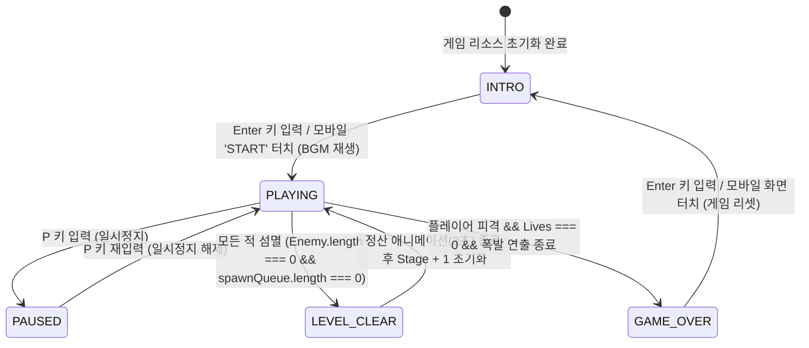
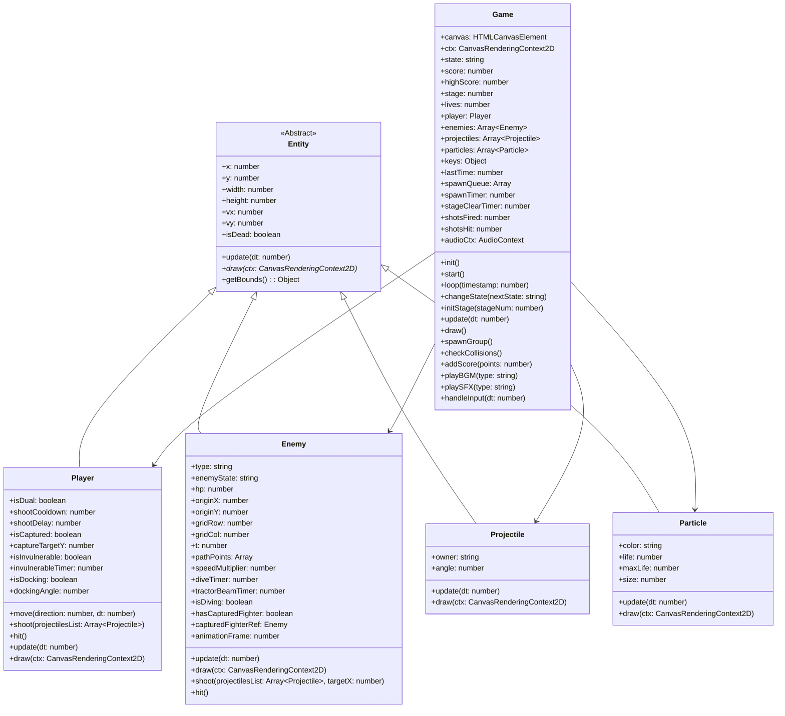
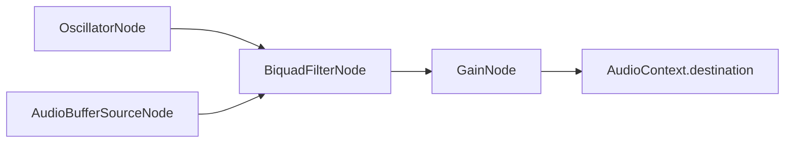

# 갤러그(Galaga) HTML5 아케이드 게임 기술 설계서 (Technical Design Spec)

본 설계서는 요구사항 정의서(`01_requirements.md`)를 기준으로 브라우저 환경에서 순수 Canvas 2D API 및 Web Audio API를 활용하여 갤러그 아케이드 게임을 안정적이고 부드럽게 구현하기 위한 물리, 상태 기계(FSM), OOP 클래스 구조 및 수학적 공식을 상세 정의한다.

---

## 1. 게임 상태 유한 상태 머신 (Finite State Machine - FSM)

게임 루프는 현재 상태(`state`)에 따라 렌더링과 업데이트의 동작 방식을 분기 처리하며, 상태 전이는 명확한 이벤트 조건 하에서 발생한다.

### 1.1 FSM 상태 전이 다이어그램 (Mermaid)



### 1.2 상태별 변수 상태 관리 및 렌더링 명세

1. **`INTRO` (대기 / 시작 화면)**
   - **관리 변수**: `stage = 1`, `score = 0`, `lives = 3`, `player = null`, `enemies = []`, `projectiles = []`
   - **동작**: 최고 점수(`highScore`)를 로컬 스토리지에서 로드하여 화면 상단 중앙에 지속 표시. 중앙에는 타이틀 로고 렌더링. 0.5초 간격으로 `"PRESS ENTER TO START"` 텍스트 점멸(Flash).
   - **이벤트**: `Enter` 입력 혹은 가상 터치 감지 시 `PLAYING` 상태로 진입.

2. **`PLAYING` (인게임 플레이)**
   - **관리 변수**: `player`, `enemies`, `projectiles`, `particles` 등이 매 프레임 업데이트 및 렌더링됨. 프레임 독립 처리를 위한 `dt`(Delta Time) 계산 작동.
   - **동작**: 키보드/터치 입력에 의한 플레이어 기기 제어, 에일리언 비행 진입 큐 처리, 하강 및 미사일 발사, 충돌 감지(`checkCollisions`), 점수 및 목숨 계산.
   - **이벤트**: `P` 입력 시 `PAUSED`, 적 궤멸 시 `LEVEL_CLEAR`, 잔기 소진 시 `GAME_OVER`.

3. **`PAUSED` (일시 정지)**
   - **관리 변수**: 전체 물리 상태 및 타이머 누적 중단. `dt` 연산을 스킵하여 객체 위치 동결.
   - **동작**: 배경 우주 스크롤 및 객체 렌더링은 정지 상태를 유지하되, 화면 중앙에 반투명 어두운 레이어와 함께 `"PAUSED"` 경고 문구 렌더링.

4. **`LEVEL_CLEAR` (스테이지 완료 정산)**
   - **관리 변수**: `stageClearTimer` (3초 타이머), `score` 보너스 연산 상태 변수.
   - **동작**: 플레이 조작 및 물리 충돌 판정을 일시적으로 비활성화. 화면 중앙에 `"STAGE CLEAR"`, `"SHOTS FIRED: X"`, `"SHOTS HIT: Y"`, `"HIT RATIO: Z%"` 통계 및 명중률 보너스 점수 점진 누적 가산 처리.
   - **이벤트**: `stageClearTimer <= 0`이 되면 `stage`를 1 증가시키고 `PLAYING` 상태로 전환하며 새 레벨 초기화.

5. **`GAME_OVER` (게임 오버)**
   - **관리 변수**: `score`와 `highScore` 비교 후 갱신 여부 판단 및 저장.
   - **동작**: 최종 점수를 화면 중앙에 고정 표시하고 `"GAME OVER"` 적색 텍스트 렌더링. 게임오버 멜로디 1회 재생.
   - **이벤트**: `Enter` 또는 화면 터치 시 모든 플레이 변수를 초기화하고 `INTRO` 상태로 전이.

---

## 2. 객체지향 설계 (OOP Class Specification)

### 2.1 클래스 구조도 (Mermaid Class Diagram)



### 2.2 상세 클래스 명세

#### 1) Game
전체 루프와 상태 관리, Canvas 컨텍스트 및 키보드 입력을 처리하는 최상위 싱글톤 컨트롤러 클래스.

*   **필드(Field)**
    *   `canvas: HTMLCanvasElement` - HTML Canvas 엘리먼트 인스턴스.
    *   `ctx: CanvasRenderingContext2D` - 2D 그래픽 렌더링 컨텍스트.
    *   `state: string` - 현재 게임 FSM 상태 (`"INTRO"`, `"PLAYING"`, `"PAUSED"`, `"LEVEL_CLEAR"`, `"GAME_OVER"`).
    *   `score: number` - 플레이어의 현재 획득 점수.
    *   `highScore: number` - 게임 최고 점수 (로컬스토리지 연동).
    *   `stage: number` - 현재 진행 중인 스테이지 번호 (1부터 시작).
    *   `lives: number` - 플레이어의 남은 라이프(잔기) 수.
    *   `player: Player | null` - 활성화된 플레이어 인스턴스.
    *   `enemies: Enemy[]` - 화면에 존재하는 적 개체들의 리스트.
    *   `projectiles: Projectile[]` - 아군 및 적군의 활성화된 발사체 리스트.
    *   `particles: Particle[]` - 격격/파괴 연출용 입자 리스트.
    *   `keys: { [key: string]: boolean }` - 키 눌림 상태를 저장하는 맵 구조.
    *   `lastTime: number` - 델타 타임 연산을 위한 직전 프레임 타임스탬프 (ms 단위).
    *   `spawnQueue: Array<{ type: string, path: string, formationGrid: { row: number, col: number } }[]>` - 순차 등장 대기 중인 적 그룹 배열 (1그룹당 8마리).
    *   `spawnTimer: number` - 그룹별 등장 간격을 제어하기 위한 타이머.
    *   `stageClearTimer: number` - 레벨 클리어 후 대기 및 보너스 정산 시간 타이머.
    *   `shotsFired: number` - 플레이어가 스테이지 동안 쏜 총 발사 탄환 수.
    *   `shotsHit: number` - 플레이어가 쏜 미사일 중 적에게 맞춘 탄환 수.
    *   `audioCtx: AudioContext | null` - Web Audio API 오디오 노드 관리를 위한 컨텍스트.
*   **주요 메서드(Method)**
    *   `init(): void`
        *   키보드 리스너 (`keydown`, `keyup`) 및 모바일 터치 리스너를 등록한다.
        *   캔버스 종횡비 유지(448x512) 및 CSS 스케일 반응형 이벤트를 바인딩한다.
    *   `start(): void`
        *   첫 프레임 타임스탬프를 획득하고 `requestAnimationFrame(this.loop.bind(this))`를 호출하여 메인 루프를 시동한다.
    *   `loop(timestamp: number): void`
        *   `dt = (timestamp - lastTime) / 1000` (초 단위) 계산 및 보정 처리.
        *   FSM 상태가 `PLAYING`일 때 `update(dt)`와 `checkCollisions()`를 순차 실행한다.
        *   상태에 관계없이 화면을 매 프레임 클리어하고 `draw()`를 수행한다.
    *   `changeState(nextState: string): void`
        *   상태를 전이하고, 전이된 상태에 따른 특정 연출(BGM 시작음, 정산 연출 등)을 초기화한다.
    *   `initStage(stageNum: number): void`
        *   적들의 포메이션 10열 4~5행 구조와 스폰 큐(`spawnQueue`)를 정의하고, 진입 경로용 베지에 조절점을 계산해 둔다.
    *   `update(dt: number): void`
        *   `player.update(dt)` 호출 및 활성 개체들(`enemies`, `projectiles`, `particles`)의 루프 업데이트.
        *   `spawnTimer`를 기반으로 `spawnQueue`에서 다음 비행조 적들을 주기적으로 스폰한다.
    *   `draw(): void`
        *   배경 스크롤링 별무리(Background Starfield)를 최하단에 렌더링하고, 플레이어, 적군, 발사체, 이펙트 및 HUD UI(SCORE, LIVES, HIGH SCORE, STAGE)를 레이어로 그린다.
    *   `checkCollisions(): void`
        *   AABB 알고리즘 및 빔 교차 검사 로직을 구동한다.
    *   `addScore(points: number): void`
        *   점수를 누적하고 보너스 라이프 규정(2만점 최초, 이후 7만점 주기) 통과 시 라이프 증가 및 알림 효과음을 발생시킨다.

#### 2) Entity
모든 화면 배치 오브젝트의 중심 속성과 속도 기반 위치 이동 로직을 정의하는 추상 기초 클래스.

*   **필드(Field)**
    *   `x: number` - 오브젝트 좌상단 기준 X 좌표.
    *   `y: number` - 오브젝트 좌상단 기준 Y 좌표.
    *   `width: number` - 충돌 및 그래픽 크기 폭.
    *   `height: number` - 충돌 및 그래픽 크기 높이.
    *   `vx: number` - X축 초당 이동 속도 (픽셀/초).
    *   `vy: number` - Y축 초당 이동 속도 (픽셀/초).
    *   `isDead: boolean` - 가비지 컬렉터 회수 기준이 되는 사망 상태 플래그.
*   **주요 메서드(Method)**
    *   `update(dt: number): void`
        *   프레임 지연 보정이 적용된 등속 물리 이동: `x += vx * dt`, `y += vy * dt`.
    *   `draw(ctx: CanvasRenderingContext2D): void`
        *   추상 메서드로 상속받은 자식 클래스에서 도트 렌더링을 재정의하도록 함.
    *   `getBounds(): { x: number, y: number, width: number, height: number }`
        *   AABB 충돌 판정을 위한 바운딩 박스 사각형 정보 반환.

#### 3) Player (Inherits Entity)
플레이어 기기의 속성 및 듀얼 파이터 합체/동작 상태를 모니터링하고 제어하는 클래스.

*   **필드(Field)**
    *   `isDual: boolean` - 듀얼 파이터 합체 여부 (true인 경우 2대 결합 모드).
    *   `shootCooldown: number` - 재발사 가능시점까지 남은 대기 시간 (초).
    *   `shootDelay: number` - 발사 간 제한 쿨다운 틱 (기본값 0.25초).
    *   `isCaptured: boolean` - 보스의 트랙터 빔에 흡수되어 회전/상승 제어 상실 상태인지의 여부.
    *   `captureTargetY: number` - 보스 도킹 고도 (일반적으로 보스가 멈춘 Y=300선).
    *   `isInvulnerable: boolean` - 피격 직후 무적 모드 여부.
    *   `invulnerableTimer: number` - 무적 모드 잔여 시간.
    *   `isDocking: boolean` - 보스 격추 후 아군 기기가 나선형 궤적을 그리며 플레이어 옆으로 와 결합하는 연출 상태 플래그.
    *   `dockingAngle: number` - 결합 도킹 시 회전 애니메이션 계산용 각도 변수.
*   **주요 메서드(Method)**
    *   `move(direction: number, dt: number): void`
        *   좌우 조작 입력에 따른 가로 스피드 가속 및 화면 범위(`[0, 448 - width]`) 외 이탈 억제 처리.
    *   `shoot(projectilesList: Projectile[]): void`
        *   쿨다운이 0 이하일 때 실행. `isDual`에 따라 단일(1발) 또는 듀얼(16px 대칭 2발) 미사일을 생성하여 리스트에 등록.
    *   `hit(): boolean`
        *   적 탄환 또는 돌진 바디와 충돌 시 작동. `isDual`이면 `isDual = false`로 감쇄 후 무적 적용 (라이프 소실 없음). 싱글이면 `isDead = true` 및 라이프 1 차감.
    *   `update(dt: number): void`
        *   쿨다운 및 무적 타이머 차감. 빔 포획(`isCaptured`) 및 합체(`isDocking`) 관련 전용 위치 수렴 물리 로직 수행.

#### 4) Enemy (Inherits Entity)
에일리언 타입별 물리 움직임, 비행 상태 머신 및 미사일 발사 인공지능을 구현한 클래스.

*   **필드(Field)**
    *   `type: string` - `"BOSS"`, `"GOON"`, `"DRONE"`, `"CAPTURED_FIGHTER"` 중 하나의 적 성격 명시.
    *   `enemyState: string` - 에일리언 개체별 비행 상태 기계 (`"ENTERING"`, `"FORMATION"`, `"DIVING"`, `"TRACTOR_BEAM"`, `"RETURNING"`).
    *   `hp: number` - 적 체력 (BOSS는 2, 나머지는 1).
    *   `originX: number` - 최종 포메이션 대열에서의 전용 목표 X 좌표.
    *   `originY: number` - 최종 포메이션 대열에서의 전용 목표 Y 좌표.
    *   `gridRow: number` - 포메이션 그리드 행 번호 (0 ~ 4).
    *   `gridCol: number` - 포메이션 그리드 열 번호 (0 ~ 9).
    *   `t: number` - 진입 궤적의 3차 베지에 매개변수 값 (0.0 ~ 1.0).
    *   `pathPoints: Array<{ x: number, y: number }>` - 해당 기가 추종하는 베지에 제어점 배열($P_0, P_1, P_2, P_3$).
    *   `speedMultiplier: number` - 스테이지 난이도에 대응한 비행 속도 가중치.
    *   `diveTimer: number` - 돌진 지속 시간을 조절하는 계수.
    *   `tractorBeamTimer: number` - 빔 지속 방출 프레임 제어 (최대 360프레임 / 6초).
    *   `isDiving: boolean` - 돌진 하강 중인지의 플래그.
    *   `hasCapturedFighter: boolean` - 보스 전용. 구출 타깃이 머리 위에 잡혀 있는지의 플래그.
    *   `capturedFighterRef: Enemy | null` - 보스 위에 도킹된 포획 파이터 오브젝트 참조.
    *   `animationFrame: number` - 날개짓(Wing flapping) 프레임 카운터.
*   **주요 메서드(Method)**
    *   `update(dt: number): void`
        *   `enemyState` 분기에 따른 이동 계산:
            *   `ENTERING`: $t$를 갱신하며 3차 베지에 공식을 통해 좌표 결정. $t \ge 1.0$ 시 `FORMATION` 상태로 전이.
            *   `FORMATION`: 그리드 기준 좌표(`originX`, `originY`)에 위치하며, 대형 전체의 좌우 슬라이드 진폭 운동($\pm 20px$ 흔들림)에 동조.
            *   `DIVING`: 플레이어의 X 좌표 방향으로 점진 하강 곡선을 그리며 강하. 화면 하단 밖으로 나가면 상단 천장으로 스폰 위치를 바꾸어 `RETURNING` 상태로 전이.
            *   `TRACTOR_BEAM`: Y=300에서 멈춰 6초간 빔 활성화 후, `RETURNING` 혹은 `DIVING` 복귀.
            *   `RETURNING`: 대형 정렬 위치(`originX`, `originY`)로 유도 가속하여 재진입 후 `FORMATION`으로 안정화.
    *   `shoot(projectilesList: Projectile[], targetX: number): void`
        *   하강 중 난이도 비례 확률로 미사일 발사. 타깃 플레이어의 가로축을 향하도록 유도 각도 `angle`을 인자로 탄 생성.
    *   `hit(): void`
        *   데미지 1 차감. BOSS의 경우 2차 피격 시 폭발 입자를 남기며 사망 판정.

#### 5) Projectile (Inherits Entity)
아군 파이터 및 적 에일리언이 사격하는 레이저/미사일 객체.

*   **필드(Field)**
    *   `owner: string` - 탄환 발사 기구 출처 (`"PLAYER"`, `"ENEMY"`).
    *   `angle: number` - 직선 및 유도 물리 연산을 위한 진행 라디안 각도 (기본 수직 방향: Player는 $-90^\circ$, Enemy는 $+90^\circ$).
*   **주요 메서드(Method)**
    *   `update(dt: number): void`
        *   `angle` 성분을 바탕으로 속도 분해 이동 적용.
        *   화면 범위 `[0, 512]` 외부로 나갈 경우 `isDead = true` 지정.

#### 6) Particle (Inherits Entity)
적 격추 및 아군 파괴 시 불꽃이 튀는 8비트 사방 비산 연출 파편 입자.

*   **필드(Field)**
    *   `color: string` - 입자 고유 색상 (`#FFFF00`, `#FF0000` 등).
    *   `life: number` - 프레임 루프 시 잔존 생존 시간.
    *   `maxLife: number` - 초기 방출 시 세팅되는 수명 임계값.
    *   `size: number` - 입자 도트의 한 변 크기 (1px ~ 3px).
*   **주요 메서드(Method)**
    *   `update(dt: number): void`
        *   공기 저항 마찰 계수를 반영한 속도 감쇄 처리 및 중력 적용.
        *   `life -= dt`에 의해 수명이 소진되면 자동 플래그 수거 처리.

---

## 3. 물리 및 수학적 공식 (Physics & Mathematics Spec)

### 3.1 델타 타임(Delta Time) 기반 프레임 보정

다양한 디스플레이 주사율(60Hz, 144Hz 등) 및 기기 연산 프레임 드랍 환경에서도 게임 내부 물리(이동 속도 등)가 일정하게 유지되도록 등속도 갱신 공식에 초 단위의 시간 간격 `dt`를 보정한다.

*   **초 단위 시간 간격 계산**:
    $$\Delta t = \frac{\text{CurrentTimestamp} - \text{LastTimestamp}}{1000} \quad (\text{seconds})$$
    *   비정상적인 지연(예: 탭 비활성화 후 복귀)을 방지하기 위해 최대 $\Delta t$는 `0.1s`로 클램프(Clamp) 제한을 둔다.
*   **물리 상수 보정**:
    *   기존 프레임당 속도($px/\text{frame}$) 단위를 초당 이동 속도($px/\text{sec}$) 단위로 전환하여 연산한다.
    *   예: 플레이어 좌우 이동 속도 $4 \, px/\text{frame}$ (60fps 기준) $\rightarrow$ $v_x = 240 \, px/\text{sec}$ 지정 후, 이동 연산 시 $x \leftarrow x + v_x \times \Delta t$ 적용.

### 3.2 3차 베지에 곡선(Bézier Curve) 편대 진입 공식

에일리언이 화면 밖에서 부드러운 호를 그리며 특정 대형 좌표로 들어올 때, 매개변수 $t \, (t \in [0, 1])$에 따른 3차 베지에 곡선 기하학 공식을 적용한다.

#### 공식 정의
$$B(t) = (1-t)^3 P_0 + 3(1-t)^2 t P_1 + 3(1-t)t^2 P_2 + t^3 P_3$$

여기서 각 제어점의 성질은 다음과 같다:
*   $P_0$: 비행 진입 시작점 (화면 바깥 좌표)
*   $P_1, P_2$: 곡선의 휘어짐률을 조절하는 내부 탄젠트 제어점
*   $P_3$: 편대 내 최종 도달 목표 좌표 ($T_x, T_y$)

#### 자바스크립트 구현용 계산 알고리즘
```javascript
/**
 * 3차 베지에 곡선 좌표 반환 함수
 * @param {Object} p0 - 시작 좌표 {x, y}
 * @param {Object} p1 - 제어점 1 {x, y}
 * @param {Object} p2 - 제어점 2 {x, y}
 * @param {Object} p3 - 목표 좌표 {x, y}
 * @param {number} t - 매개변수 (0.0 ~ 1.0)
 * @returns {Object} {x, y} 결과 좌표
 */
function getBezierPoint(p0, p1, p2, p3, t) {
    const u = 1 - t;
    const tt = t * t;
    const uu = u * u;
    const uuu = uu * u;
    const ttt = tt * t;

    const x = uuu * p0.x + 3 * uu * t * p1.x + 3 * u * tt * p2.x + ttt * p3.x;
    const y = uuu * p0.y + 3 * uu * t * p1.y + 3 * u * tt * p2.y + ttt * p3.y;

    return { x, y };
}
```

*   **진입 보정 메커니즘**:
    *   진입에 할당된 목표 시간(160프레임 $\approx 2.67$초) 동안 $t$는 $0$에서 $1$까지 고르게 누적된다.
    *   매 프레임당 $t$의 증가율 $dt_{t}$는 다음과 같이 보정한다:
        $$dt_{t} = \frac{1}{160} \times \frac{\Delta t}{0.01667} \approx 0.375 \times \Delta t$$

---

### 3.3 보스 트랙터 빔 렌더링 및 영역 캡처 수학 공식

보스 에일리언이 하강 도중 $Y = 300$ 지점에 도달하면 지상(아래 방향)을 향해 역사다리꼴 모양의 트랙터 빔 영역을 생성한다.

#### 빔 영역 기하학 규격
*   보스의 현재 중심 X 좌표를 $X_b$, 보스 하단 경계의 Y 좌표를 $Y_b$라 정의한다.
*   **상단 폭**: $W_{top} = 32 \, px$ (보스 중심 기준 좌우 $\pm 16 \, px$)
*   **하단 폭**: $W_{bottom} = 96 \, px$ (보스 중심 기준 좌우 $\pm 48 \, px$)
*   **높이**: $H = 150 \, px$
*   따라서 빔의 유효 세로 범위는 $Y \in [Y_b, Y_b + 150]$ 이다.

```
       Xb - 16       Xb + 16
          +-----------+  <- Yb (보스 기지 하단)
         /    (Beam)   \
        /               \
       /                 \
      +-------------------+  <- Yb + 150
   Xb - 48               Xb + 48
```

#### 영역 캡처(Point-in-Trapezoid) 판정 수식
플레이어 기기 중심점 $P = (X_p, Y_p)$가 이 역사다리꼴 영역 내에 포함되는지 확인하기 위해 다음의 수학적 경계 방정식을 사용한다.

1.  **Y축 범위 1차 필터링**:
    $$Y_b \le Y_p \le Y_b + 150$$
2.  **Y값에 따른 유효 X반폭(Half-Width) 계산**:
    높이가 $Y_b$에서 $Y_b + 150$으로 하강할 때, 중심축 기준 빔의 좌우 반폭 $W_{half}(Y)$는 $16 \, px$에서 $48 \, px$로 선형적으로 비례하여 확장된다.
    $$W_{half}(Y_p) = 16 + \frac{48 - 16}{150} \times (Y_p - Y_b) = 16 + \frac{32}{150}(Y_p - Y_b) = 16 + \frac{16}{75}(Y_p - Y_b)$$
3.  **X축 범위 최종 판정**:
    플레이어 기기 중심 X가 보스 중심 $X_b$로부터 이 반폭 범위 안에 있는지 절댓값 연산으로 확인한다.
    $$|X_p - X_b| \le W_{half}(Y_p)$$
    즉, 종합 충돌 검증 조건식은 다음과 같다.
    $$\left( Y_b \le Y_p \le Y_b + 150 \right) \land \left( |X_p - X_b| \le 16 + 0.2133 \times (Y_p - Y_b) \right)$$

---

### 3.4 2D AABB 충돌 판정 알고리즘

플레이어 투사체와 적 본체, 적 투사체와 플레이어 본체 간의 사각형 기반 충돌 충돌 감지는 Axis-Aligned Bounding Box (AABB) 알고리즘을 사용하여 계산 효율을 극대화한다.

#### 판정 공식
두 사각형 오브젝트 $A$와 $B$가 각각 좌표 $(A_x, A_y)$, 크기 $(A_w, A_h)$ 및 $(B_x, B_y)$, 크기 $(B_w, B_h)$를 가질 때, 두 영역이 교차할 충분조건은 다음과 같다.

$$\text{Collision}(A, B) \iff \left( A_x < B_x + B_w \right) \land \left( A_x + A_w > B_x \right) \land \left( A_y < B_y + B_h \right) \land \left( A_y + A_h > B_y \right)$$

#### 자바스크립트 구현용 계산 알고리즘
```javascript
/**
 * AABB 사각형 충돌 검사
 * @param {Object} r1 - 첫 번째 사각형 바운딩 박스 {x, y, width, height}
 * @param {Object} r2 - 두 번째 사각형 바운딩 박스 {x, y, width, height}
 * @returns {boolean} 충돌 여부
 */
function checkCollision(r1, r2) {
    return (
        r1.x < r2.x + r2.width &&
        r1.x + r1.width > r2.x &&
        r1.y < r2.y + r2.height &&
        r1.y + r1.height > r2.y
    );
}
```

---

## 4. 오디오 및 그래픽 시스템 사양 (Audio & Graphic Specifications)

### 4.1 Web Audio API 기반 실시간 신디사이저 그래프

외부 미디어 에셋 로딩 딜레이 및 트래픽 문제를 방지하고자 Web Audio API를 활용하여 게임 가동 중에 오디오 주파수를 파형 발생기로 합성한다.

#### 1) 효과음 생성 회로도 및 연결 방식 (Audio Graph)



#### 2) 효과음 합성 명세 테이블

*   **레이저 발사음**:
    *   **오실레이터**: `sawtooth` 타입.
    *   **주파수 변조(FM)**: 시작 주파수 $880 \, Hz$에서 $0.12$초 간 지수 감소(ExponentialRampToValueAtTime)로 $110 \, Hz$까지 급감.
    *   **볼륨 엔벨로프**: $0.2 \rightarrow 0.0$ 선형 쇠퇴.
*   **적 에일리언 격추음 (소형)**:
    *   **노이즈 발생기**: $0.25$초 분량의 화이트 노이즈 버퍼를 동적 생성하여 소스로 지정.
    *   **필터**: $400 \, Hz$ 대역폭의 밴드패스 필터(`bandpass`) 결합.
    *   **볼륨 엔벨로프**: $0.5 \rightarrow 0.0$ 지수적 감소.
*   **보스 격추음**:
    *   **노이즈 발생기**: $0.40$초 분량의 화이트 노이즈 버퍼 생성.
    *   **필터**: $200 \, Hz$ 로우패스 필터(`lowpass`) 적용하여 묵직하고 폭넓은 폭발음 연출.
    *   **볼륨 엔벨로프**: $0.8 \rightarrow 0.0$ 지수적 감소.
*   **트랙터 빔 방출 루프음**:
    *   **신디사이징**: 저주파 발진기(LFO, $6 \, Hz$, 사인파)가 메인 오실레이터(Carrier, $220 \, Hz$)의 주파수를 주기로 제어하는 주파수 변조(FM) 합성 기법 적용.
    *   **볼륨**: 빔이 켜져 있는 동안 일정하게 $0.3$ 레벨 유지.

#### 3) 레트로 BGM 오케스트레이션 설계
*   `OscillatorNode`의 `type = 'square'`를 사용하여 아케이드 레트로 감성의 칩튠(Chiptune) 톤을 발생시킨다.
*   **노트 시퀀스 연동**: `[주파수, 박자]` 단위의 JSON 데이터를 구성하여 타이머 스레드를 연동해 순차 연주한다.
    *   시작 멜로디 시퀀스 예:
        `[[392.00, 0.25], [523.25, 0.25], [392.00, 0.25], [329.63, 0.25], [392.00, 0.125], [392.00, 0.125], [523.25, 0.25]]` 등

---

### 4.2 픽셀 맵 그래픽 데이터 렌더링 엔진 구조

스프라이트 시트 이미지 파일 없이 2차원 픽셀 문자열 정보를 실시간 디코드하여 드로잉하는 내장 렌더링 파이프라인을 채택한다.

#### 1) 픽셀 아트 비트맵 매핑 예시 (플레이어 전투기)
```javascript
const PALETTE = {
    '.': 'transparent',
    'W': '#FFFFFF',
    'R': '#FF0000',
    'B': '#0000FF',
    'G': '#00FF00',
    'Y': '#FFFF00',
    'C': '#00FFFF'
};

const SPRITE_PLAYER = [
    ".......WW.......",
    "......WWWW......",
    ".....WWWWWW.....",
    ".....WRWWRW.....",
    ".....WRWWRW.....",
    "....WWWWWWWW....",
    "...WWWWWWWWWW...",
    "..WWWWRRRRWWWW..",
    ".WWWWRRRRRRWWWW.",
    "WWWWWWWWWWWWWWWW",
    "WWW...WWWW...WWW",
    "WW....WWWW....WW",
    "W.....WWWW.....W",
    "W......WW......W",
    ".......WW.......",
    ".......WW......."
];
```

#### 2) 도트 렌더링 파서 알고리즘 (Drawing Engine)
```javascript
/**
 * 픽셀 맵 스프라이트 드로잉 함수
 * @param {CanvasRenderingContext2D} ctx - 캔버스 2D 컨텍스트
 * @param {string[]} sprite - 16x16 문자열 픽셀 맵 배열
 * @param {number} x - 렌더링할 타깃 좌상단 X 좌표
 * @param {number} y - 렌더링할 타깃 좌상단 Y 좌표
 * @param {number} scale - 픽셀 확장 배율 (기본값: 1, 1px 도트를 scale * scale 크기로 확장)
 */
function drawPixelSprite(ctx, sprite, x, y, scale = 1) {
    const rows = sprite.length;
    const cols = sprite[0].length;

    for (let r = 0; r < rows; r++) {
        for (let c = 0; c < cols; c++) {
            const char = sprite[r][c];
            if (char === '.' || char === ' ') continue; // 투명 영역 스킵
            
            ctx.fillStyle = PALETTE[char] || '#FFFFFF';
            ctx.fillRect(
                x + c * scale, 
                y + r * scale, 
                scale, 
                scale
            );
        }
    }
}
```

*   **스프라이트 분할 및 갱신 구조**:
    *   애니메이션 프레임(예: 에일리언 날개 펼치기/접기)에 따라 각각 인덱스 0, 1의 `SPRITE_ENEMY` 픽셀 배열을 교대로 참조하게끔 적 개체 내 `animationFrame` 루프 분기를 포함하여 설계한다.
    *   화상 확대 배율 `scale = 1`을 기본으로 설정하며, 기기 해상도가 늘어날 경우 스케일 값을 선형 증가시켜 도트 경계선이 깨지지 않는 원본 비주얼(Nearest-Neighbor scaling 효과)을 재현한다.
